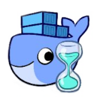

  
  
  
  
  
   
  
  
  

---

## What is swarm-cronjob?

**swarm-cronjob** creates jobs on a time-based schedule on [Swarm](https://docs.docker.com/engine/swarm/) with a
dedicated service in a distributed manner that configures itself automatically and dynamically through
[labels](https://docs.docker.com/engine/reference/commandline/service_create/#set-metadata-on-a-service--l---label)
and Docker API.

## Features

* Continuously updates its configuration (no restart)
* Cron implementation through go routines
* Allow to skip a job if the service is currently running
* Timezone can be changed for the scheduler

## License

This project is licensed under the terms of the MIT license. 
Icon credit to [Laurel](https://twitter.com/laurelcomics).
