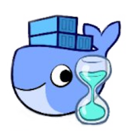

  
  
  
  
  
   
  
  
  

---

## What is swarm-cronjob?

**swarm-cronjob** is a scheduler for [Docker Swarm](https://docs.docker.com/engine/swarm/).
You define a cron-style schedule with [service labels](https://docs.docker.com/engine/reference/commandline/service_create/#set-metadata-on-a-service--l---label),
and swarm-cronjob turns that service into a recurring job. It watches the
Docker API, keeps its configuration in sync as services are added or updated,
and runs scheduled workloads directly inside your Swarm cluster.

## Features

* Label-driven configuration, define schedules directly on Swarm services
* Automatic service discovery and configuration reloads, no restart required
* Cron-style scheduling for recurring jobs inside your Swarm cluster
* Overlap control, can skip a run if the target service is already running
* Configurable scheduler time zone

## License

This project is licensed under the terms of the MIT license. 
Icon credit to [Laurel](https://twitter.com/laurelcomics).
